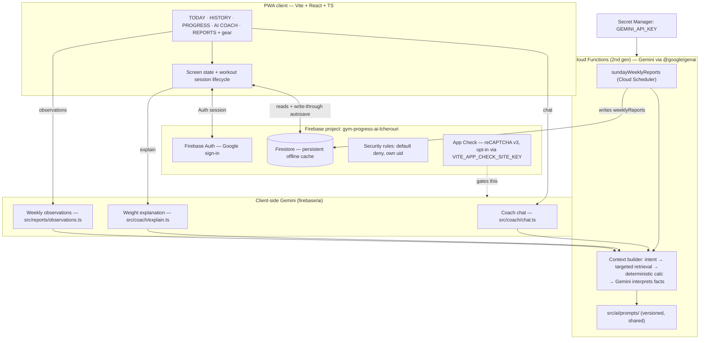

# Architecture

Gym Progress AI — Vite + React + TypeScript PWA on Firebase. Design goals:
local-first (gym wifi is unreliable), portable (Google ecosystem only, no vendor
lock beyond it), and safe (the `GEMINI_API_KEY` secret never reaches the
browser).

Two distinct Gemini paths exist, and the difference matters:

- **Client-side, via `firebase/ai`** — the interactive Coach chat, weight
  explanations, and weekly observations call `getAI(app, { backend: new
  GoogleAIBackend() })` in `src/coach/chat.ts`, `src/coach/explain.ts`, and
  `src/reports/observations.ts`. These run on the user's Firebase web app
  (Firebase AI Logic), not through a Cloud Function. No secret is exposed —
  the  browser only holds the referrer-restricted web API key — but the call is
  a billable client-initiated request, which is what App Check covers
  (AGENTS.md §5).
- **Server-side, via `@google/genai`** — the Sunday scheduled weekly report in
  `functions/src/index.ts` uses `GoogleGenAI` with `GEMINI_API_KEY` from Secret
  Manager. It is the only Gemini call in `functions/`, and there is no AI
  callable endpoint for clients.

## System diagram

## Layers

1. **Presentation** (`src/screens/`) — one screen per nav tab; large-print
   components in `src/components/`; controlled inputs only.
2. **State** (`src/workout/`, screen hooks) — focused hooks own screen state,
   workout lifecycle, and sync status. Persistent workout state is stored in
   Firestore rather than a separate reducer/context store.
3. **Data** (`src/data/`) — Firestore repositories per collection, Zod-validated
   on writes; persistent offline cache and write-through autosave; previous-
   weight lookup via `exerciseStats` rollups with history fallback.
4. **Server** (`functions/src/`) — the scheduled weekly report, deterministic
   calculators, context builders. Admin SDK only here.

Shared code is one-directional: `functions/src/` imports pure logic from the
client tree — `src/domain/session`, `src/progress/stats`, `src/reports/weekly`,
`src/ai/prompts/*` — plus the contracts in `src/shared/`. The client never
imports from `functions/`. Those shared modules must stay free of browser APIs
and the Firebase Web SDK; `functions/tsconfig.json` compiles with `lib: ES2022`
and no DOM, so a browser API fails the functions build.

The prompts are shared too, which is why `src/ai/prompts/` lives on the client
side of the tree even though the server reads it.

## Data flow: logging a set

1. A workout starts by atomically writing an `in_progress` session and its
   exercise documents in one Firestore batch.
2. User changes a weight, note, symptom, or set → the screen updates and the
   repository writes the validated value through to Firestore immediately.
3. Firestore's persistent local cache queues writes offline and syncs them when
   connectivity returns; the chip shows SYNCING → SAVED (or OFFLINE).
4. On workout-area entry, recovery queries for an unfinished session and loads
   its exercises and sets before showing the plan. If the recovery check fails,
   starting a duplicate workout is blocked until the user retries.
5. On session completion, deterministic code recomputes `exerciseStats` and
   `personalRecords` from history (derived caches — sessions stay the source
   of truth).

## AI context pipeline (Coach chat, explanations, weekly observations)

1. **Determine intent** (which exercise / which question class).
2. **Retrieve only relevant records** (bounded queries: e.g. last N sessions
   for one exerciseKey).
3. **Compute numeric facts in deterministic code** (totals, deltas, streaks,
   PRs) — never asked of Gemini.
4. **Send the facts to Gemini** with a versioned prompt from
   `src/ai/prompts/`.
5. **Gemini interprets** and returns typed structured output (Zod-validated).
6. **Store the recommendation + facts + promptVersion** (audit trail) and
   return it to the client.

The full database is never sent to Gemini. Missing data stays missing: the
flows answer "I don't have enough workout history yet." instead of inventing.

## Weight recommendation (deterministic shell around Gemini)

- Candidate weight math (increment direction, machine increment bounds) is
  computed in code from history + difficulty + pain reports.
- Safety gate first: if the session/exercise carries concerning symptom flags,
  no progression output at all — the response is the fixed safety copy
  (see `docs/AI-SAFETY.md`).
- Gemini's job is the explanation and the conservative judgment within the
  computed candidate range. Output: `{ suggestedWeight, reason, decision }`.
- The user decides: USE / KEEP / CHOOSE ANOTHER. The AI never writes
  `weightUsed`.

## Model and prompt configuration

- Client model default lives in one place: `DEFAULT_MODEL` in
  `src/coach/explain.ts` (`gemini-2.5-flash`), re-exported into `chat.ts` and
  `reports/observations.ts`. There is no environment override on the client
  path; the comment above the constant records that as a future change.
- The server keeps its own default in `functions/src/index.ts`:
  `process.env.GEMINI_MODEL || "gemini-2.5-flash"`, with a comment requiring
  the two to stay in sync. A single shared table (`functions/src/ai/models.ts`
  in earlier drafts) does not exist.
- Prompts are versioned modules in `src/ai/prompts/` (`coach-chat.ts`,
  `weight-explanation.ts`, `weekly-observations.ts`), each exporting
  `PROMPT_VERSION`; stored recommendations and reports carry the version used.

## Offline and recovery model

- Firestore's persistent local cache is the durable source for workout sessions,
  exercises, and sets. Repository writes are immediate; offline writes remain
  queued in the SDK cache for synchronization when the network returns.
- The session and its exercise drafts are committed atomically with status
  `in_progress`; the UI does not expose a partially created workout.
- On workout-area entry, the session hook finds and rehydrates the latest
  in-progress session, including exercise values and saved sets, before offering
  a new plan. A failed recovery check blocks a new start until retry succeeds.
- Refresh recovery uses Firestore's local cache and normal Firestore
  synchronization. There is no separate localStorage workout mirror.
- The SAVED / SYNCING / OFFLINE chip derives from connection state + pending
  write count.

## Security boundaries

- Identity: Firebase Auth on the client; verified ID tokens server-side. Path
  security by `request.auth.uid`; client-supplied uids are ignored.
- App Check: initialized on the client by `src/data/app-check.ts` (reCAPTCHA
  v3), awaited inside `initAuth` before Auth and Firestore are constructed so
  the token exists before anything goes over the network. Opt-in — without
  `VITE_APP_CHECK_SITE_KEY` nothing is initialized, and initialization can never
  throw, so an unregistered environment or a blocked reCAPTCHA degrades to "no
  token" rather than a dead app.
- Two exclusions, both explicit in code. The **emulator** does not implement
  App Check. **`/__boot`** cannot: its reporter is a dependency-free IIFE
  inlined into `index.html` that has no SDK and therefore no token, so
  `enforceAppCheck: false` on `reportBootFailure` is a written decision, not a
  default. That endpoint is instead bounded by Zod length caps, an
  allow-list that strips unknown fields, and a 10-minute dedupe window.
- `GEMINI_API_KEY` exists only in Secret Manager and the Functions runtime.
- Rules default-deny with shape validation; privileged writes only via Admin
  SDK.

## Deployment topology

Firebase Hosting (static Vite build + SPA fallback that excludes `/assets/**`,
so a deleted chunk 404s instead of returning the shell), Cloud Functions (2nd
gen), Firestore + Indexes + Rules via `npm run deploy`. Cloud Scheduler fires
`sundayWeeklyReports` on `SUNDAY_CRON` and `sendWorkoutReminders` every five
minutes (`REMINDER_CRON`, a per-user send guard, not Mon/Wed/Fri).
