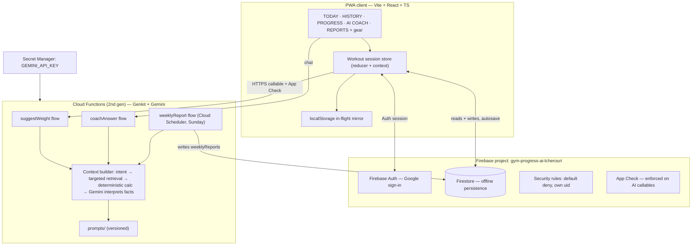

# Architecture

Gym Progress AI — Vite + React + TypeScript PWA on Firebase, with all Gemini
work executed server-side. Design goals: local-first (gym wifi is unreliable),
portable (Google ecosystem only, no vendor lock beyond it), and safe (private
workout history and API credentials never reach the browser).

## System diagram

## Layers

1. **Presentation** (`src/screens/`) — one screen per nav tab; large-print
   components in `src/components/`; controlled inputs only.
2. **State** (`src/store/`) — workout session store (reducer + context):
   current session draft, per-exercise working values, sync status.
3. **Data** (`src/data/`) — Firestore repositories per collection, Zod-validated
   on write; offline persistence enabled; previous-weight lookup via
   `exerciseStats` rollups with a bounded history fallback.
4. **Server** (`functions/src/`) — Genkit flows, deterministic calculators,
   context builders, prompt modules. Admin SDK only here.

Client and server share only Zod schemas and pure types (`src/shared/`).

## Data flow: logging a set

1. User taps reps/weight → store updates → optimistic render.
2. Repository write-through to Firestore (Zod-validated). Firestore SDK queues
   it offline if needed; the chip shows SYNCING → SAVED (or OFFLINE).
3. The same payload lands in the localStorage in-flight mirror so a hard crash
   recovers on reopen.
4. On session completion, deterministic code recomputes `exerciseStats` and
   `personalRecords` from the session (derived caches — sessions stay the
   source of truth).

## AI context pipeline (all flows)

1. **Determine intent** (which exercise / which question class).
2. **Retrieve only relevant records** (bounded queries: e.g. last N sessions
   for one exerciseKey).
3. **Compute numeric facts in deterministic code** (totals, deltas, streaks,
   PRs) — never asked of Gemini.
4. **Send the facts to Gemini** with a versioned prompt from
   `functions/src/ai/prompts/`.
5. **Gemini interprets** and returns typed structured output (Zod-validated).
6. **Store the recommendation + facts + promptVersion** (audit trail) and
   return it to the client.

The full database is never sent to Gemini. Missing data stays missing: the
flows answer "I don't have enough workout history yet." instead of inventing.

## Weight recommendation (deterministic shell around Gemini)

- Candidate weight math (increment direction, machine increment bounds) is
  computed in code from history + difficulty + pain reports.
- Safety gate first: if the session/exercise carries concerning symptom flags,
  no progression output at all — the response is the fixed safety copy
  (see `docs/AI-SAFETY.md`).
- Gemini's job is the explanation and the conservative judgment within the
  computed candidate range. Output: `{ suggestedWeight, reason, decision }`.
- The user decides: USE / KEEP / CHOOSE ANOTHER. The AI never writes
  `weightUsed`.

## Model and prompt configuration

- Model names resolve from one table (`functions/src/ai/models.ts`): environment
  variable override first, hardcoded default last. Call sites never hardcode a
  model name.
- Prompts are versioned files (`functions/src/ai/prompts/<name>.v<N>.ts`), each
  exporting `PROMPT_VERSION`; recommendations store the version used.

## Offline and recovery model

- Firestore offline persistence is the sync source of truth.
- localStorage mirrors in-flight session edits (keyed `gpa:draft:<sessionId>`)
  for crash recovery; drafts rehydrate on load and reconcile with the server
  copy (server wins on completed fields, local wins on newer timestamps).
- The SAVED / SYNCING / OFFLINE chip derives from connection state + pending
  write count.

## Security boundaries

- Identity: Firebase Auth on the client; verified ID tokens server-side. Path
  security by `request.auth.uid`; client-supplied uids are ignored.
- App Check enforced on AI callables (quota + history protection).
- `GEMINI_API_KEY` exists only in Secret Manager and the Functions runtime.
- Rules default-deny with shape validation; privileged writes only via Admin
  SDK.

## Deployment topology

Firebase Hosting (static Vite build + SPA fallback), Cloud Functions (2nd
gen), Firestore + Indexes + Rules via `firebase deploy`. Cloud Scheduler fires
`weeklyReport` Sundays (configurable hour) and, when enabled, reminder jobs
Mon/Wed/Fri.
